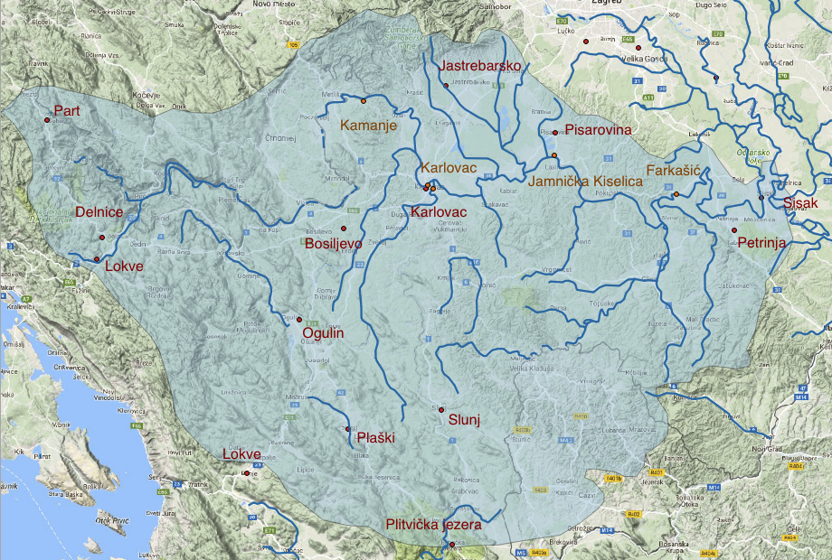

## Sensory Data Time Series Forecast

An excerpt from my thesis where I was tasked to create a machine learning based forecast for water level and flow of river Kupa in Croatia.

The case study was about using upstream data about water level, flow and raindrop to create a forecast for river data downstream. The multivariate forecast was done using the statistical VAR model and the LSTM model. 

### Data
---

The time series data consists of 4 hydrological stations and various meteorological stations along the stream of river Kupa. The received data consisted of daily readings of 6 years of rainfall(mm), flow(m^3/2) and water level (cm). The first 5 years were used as training for the models and the last year is used as test data in these samples.

 

### Files
---
The forecasting methods are presented in a couple of python notebooks.

- Series-Analysis.ipynb - shows the methods to infer the stationarity of the series
- Baseline.ipynb - shows the baseline models used for the forecast
- VAR-one-step.ipynb - contains the one step VAR model
- LSTM-one-step.ipynb - contains the one step LSTM model

Also, couple of other .py files are used to hold utility methods. 

### Dependencies
---
- numpy
- pandas
- tensorflow 1.1.0
- keras 2.1.5
- statsmodels 0.9.0

### References
---
https://www.otexts.org/fpp

https://machinelearningmastery.com/introduction-to-time-series-forecasting-with-python/